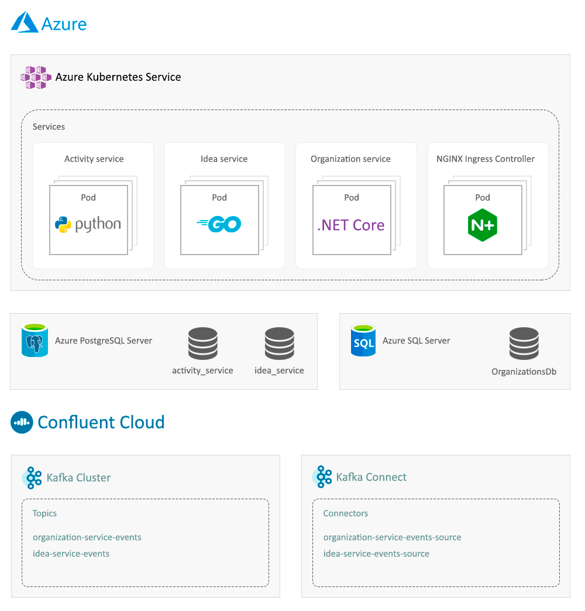

# microservicesapp

* [Introduction](#Introduction)
* [Architecture](#Architecture)
    * [Infrastructure as Code with Terraform](#Infrastructure-as-Code-with-Terraform)
    * [Scalable orchestration of services with Kubernetes](#Scalable-orchestration-of-services-with-Kubernetes)
    * [Continuous integration and deployment with CircleCI](#Continuous-integration-and-deployment-with-CircleCI)
    * [Efficient development environment with docker-compose](#Efficient-development-environment-with-docker-compose)
    * [Asynchronous event driven communication between services with Kafka](#Asynchronous-event-driven-communication-between-services-with-Kafka)

## Introduction

Microservicesapp is a backend, cloud-native [microservice architecture](https://microservices.io/) based application. The purpose of microservicesapp is to demonstrate best practices and patterns for developing efficient, scalable and maintainable microservice applications with modern technologies. The focus is on how to develop a solid architecture that can be used to build scalable business systems. The technologies used in microservicesapp are [.NET Core](https://dotnet.microsoft.com/learn/aspnet/what-is-aspnet-core), [Python](https://www.python.org/), [Go](https://golang.org/), [Terraform](https://www.terraform.io/), [Docker](https://www.docker.com/), [Kubernetes](https://kubernetes.io/), and [Kafka](https://kafka.apache.org/).

While the focus of microservicesapp is on architecture rather than business domain, it is developed as a small knowledge sharing platform, to show how to apply the best practices and patterns in a real world context. Organizations can use microservicesapp to manage members in their organization, create and share ideas between these, and track activity happening within their organization.

Microservicesapp consists of the following three services. Each service has a README associated with it in it's folder. Click on a service name to go to it's folder: 

| Service | Programming Language & Platform | Database | 
| ------- | ------------------------------- | -------- |
| [Organization Service](services/organization-service) | C# / .NET Core 3.1 | SQL Server 2017 |
| [Activity Service](services/activity-service) | Python 3.8 | PostgreSQL 11 |
| [Idea Service](services/idea-service) | Go 1.15 | PostgreSQL 11 |

## Architecture

Microservicesapp is built to be deployed on a Kubernetes cluster, on a cloud vendor such as Azure using [Azure Kubernetes Service](https://azure.microsoft.com/en-us/services/kubernetes-service) (AKS). The diagram below illustrates an example setup in Azure. An [Azure Public IP](https://docs.microsoft.com/en-us/azure/virtual-network/public-ip-addresses) directs inbound traffic to the cluster. The cluster pulls the services docker images from an [Azure Container Registry](https://azure.microsoft.com/en-us/services/container-registry/). [Azure PostgreSQL server](https://azure.microsoft.com/en-us/services/postgresql/) and  [Azure SQL Server](https://azure.microsoft.com/en-us/services/sql-database/campaign/) provide the databases for the services.

In this example, [Confluent Cloud](https://www.confluent.io) is responsible for providing the kafka cluster, schema registry and kafka connectors. It is advantageous to use a managed kafka service instead of hosting a cluster yourself, as a managed service such as Confluent abstracts away the need to maintain and monitor the cluster. This gives developers more time to focus on the business logic of their applications.

### Infrastructure as Code with Terraform

The example infrastructure of microservicesapp can be deployed on Azure using the [Infrastructure as Code (IaC)](https://en.wikipedia.org/wiki/Infrastructure_as_code) tool [Terraform](https://www.terraform.io/). Terraform utilizes `.tf` configuration files to declare a desired infrastructure state. The declarared state can then be created using the Terraform CLI. The Terraform files for microservicesapp can be viewed [here](terraform/azure).

Using an IaC approach, the entire application stack can easily be deployed, replicated for test environments, or destroyed if need be. The configuration files can be tracked with a version control system such as git, which makes it easy to share them between multiple team members.

Microservicesapp follows the pattern of terraform modules to improve maintainability and readability of the configuration code. Modules are similar to modules in a conventional programming language such as Python, where common functionaility is grouped together. The module `aks` contains AKS, Public IP and Container Registry. The module `sql`, contains the PostgreSQL server and databases, and the SQL Server with its one database.

### Scalable orchestration of services with Kubernetes

Microservicesapp is built to be deployed on a [Kubernetes](https://kubernetes.io/) cluster. Kubernetes is a container orchestration system that simplifies deployment and maintenance of applications at scale. The Kubernetes deployments of microservicesapp are maintained with YAML files. These can be viewed [here](k8s).

Microservicesapp consists of four Kubernetes deployments. A deployment for each of the three microservices, and a [NGINX Ingress Controller](https://kubernetes.github.io/ingress-nginx/) deployment that handles ingress. NGINX Ingress Controller acts as a load balancer, and redirects inbound traffic from the Azure Public IP to the services.

### Continuous integration and deployment with CircleCI

Microservicesapp utilizes [Continuous integration and deployment](https://en.wikipedia.org/wiki/CI/CD) (CI/CD) for test and deployment. When code is committed to the repository, they are picked up by a [CircleCI](https://circleci.com/) CI/CD pipeline through a github webhook.

The pipeline runs the test suite associated with each service using [docker-compose](https://docs.docker.com/compose/). By using docker-compose, the testing process is relatively vendor agnostic. The environment for the test suite is described in the dockerfile for the service, so there is no need to maintain a separate environment configuration at the CI/CD provider level. The steps in the CircleCI configuration could therefore easily be altered to work on another CI/CD provider that supports docker.

If all tests pass for a service, the service will be built as a docker image and deployed to Azure Container Registry. A Kubernetes image rollout is then initiated to update the deployment of the service to the newest image. The CircleCI configuration can be viewed [here](.circleci/config.yml) and the docker-compose file used for testing can be viewed [here](docker-compose.test.yml).

### Efficient development environment with docker-compose

The [docker-compose](https://docs.docker.com/compose/) tool is used in microservicesapp to easily run a local development environment. As each service can be started in a container, all of the services can be run at the same time in a multi container setup using docker-compose. The docker-compose configuration file for the local microservicesapp environment can be viewed [here](docker-compose.yml).

The docker-compose configuration also starts local instances of external system dependencies used by microservicesapp, such as zookeeper, kafka and kafka connect. The development environment is therefore truely local, with no dependencies on the Confluent Cloud managed service.

### Asynchronous event driven communication between services with Kafka

Microservicesapp follows a [database-per-service](https://microservices.io/patterns/data/database-per-service.html) and [event driven architecture](https://microservices.io/patterns/data/event-driven-architecture.html) approach. Any create or update operation in either of the services produces an event describing the operation. Because business transactions may span multiple services, it is essential to have a mechanism that allows for services to know when something happened in another service.

It is advisable to use an asynchronous approach for service-to-service communication whenever possible. In practical terms, this means that whenever one service needs data produced by another service, it should not have to call that other service directly. It should rather get the data from the other service through an asynchronous back channel. By reducing direct communication between services, there is also a reduced risk in request failure, as a call to a service does not have to depend on another service being available.

This is accomplished in microservicesapp by making use of [kafka](https://kafka.apache.org/) as a messaging platform. Microservicesapp utilizes the [outbox pattern](https://microservices.io/patterns/data/transactional-outbox.html) by having each service store it's events in it's own database. A [Kafka connector](https://docs.confluent.io/current/connect/index.html) then retrieves these events as they are created, and produces them to a service specific topic. Activity service listens to each service topic, and stores the events as activities, providing a single source of truth for all organizational activity. 
